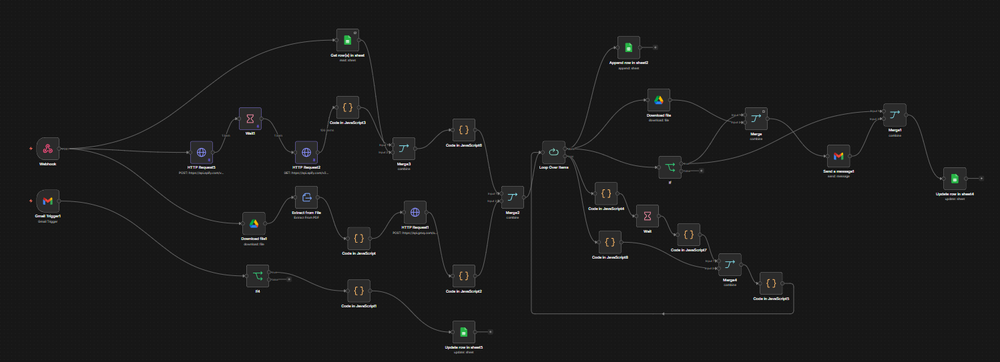
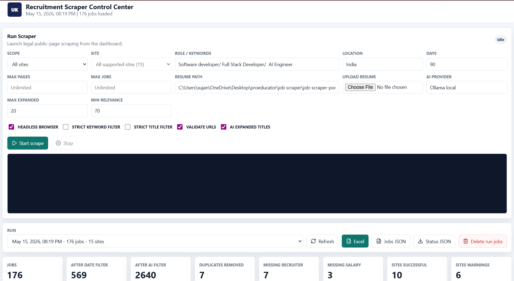
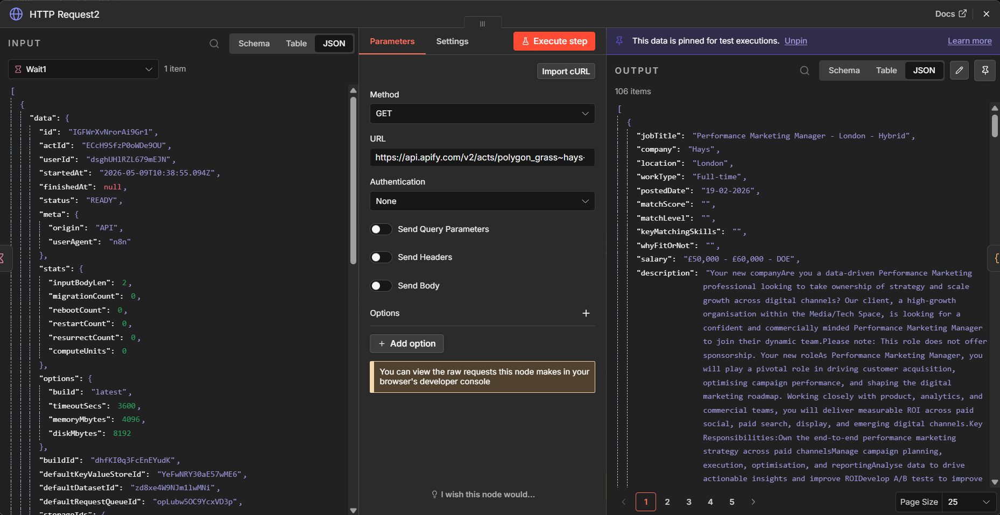
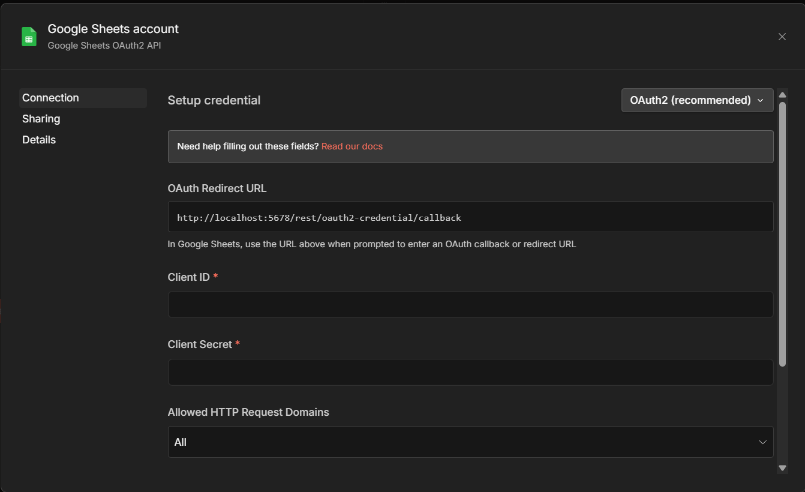

# HireFlow AI Automation

AI-powered recruitment automation platform built using n8n workflows, intelligent job scraping pipelines, resume matching, AI scoring, and automated job processing systems.

This platform automates the entire recruitment discovery workflow — from scraping jobs across multiple platforms to AI-powered filtering, relevance scoring, structured exports, and intelligent processing.

---

# 🚀 Features

## 🤖 AI-Powered Job Matching
- AI-based relevance scoring
- Resume-to-job compatibility analysis
- Skill extraction & matching
- Smart filtering pipeline
- Match explanations using AI

---

## 🌐 Automated Job Scraping
- Multi-site job scraping
- Automated browser workflows
- Keyword-based search
- AI-expanded job titles
- URL validation
- Duplicate removal

---

## 📄 Resume Processing
- PDF resume extraction
- Resume parsing pipeline
- AI-ready structured data generation
- Resume upload support

---

## ⚡ Workflow Automation
- Fully automated n8n workflows
- Scheduled scraping pipelines
- Loop-based processing system
- Conditional routing
- Merge & filtering pipelines

---

## 📊 Recruitment Control Center
- Job scraping dashboard
- Live run monitoring
- Job statistics
- Export functionality
- Scraping analytics
- Site success tracking

---

## 📁 Export & Data Management
- Excel export support
- JSON exports
- Google Sheets integration
- Structured output pipelines

---

## 🔗 Integrations
- n8n
- Apify API
- Google Sheets API
- Gmail API
- AI providers (LLM integration)
- Resume parsing services

---

# 🛠️ Tech Stack

## Automation & Workflows
- n8n

## AI Processing
- LLM-based job scoring
- AI matching pipelines
- Prompt engineering

## Backend & APIs
- Node.js
- REST APIs
- Apify API

## Storage & Exports
- Google Sheets
- Excel
- JSON pipelines

---

# 📂 Project Structure

```bash
hireflow-ai-automation/
│
├── images/                 # README screenshots
├── workflows/              # n8n workflow exports
├── README.md
└── LICENSE
```

---

# ⚙️ Core Workflow Pipeline

The automation pipeline performs:

1. Resume upload & parsing
2. Multi-platform job scraping
3. AI-based job relevance analysis
4. Duplicate filtering
5. Match scoring
6. Google Sheets export
7. Excel/JSON generation
8. Email notification workflows

---

# 🔄 Workflow Architecture

```text
Resume Upload
      ↓
Resume Parsing
      ↓
Job Scraping APIs
      ↓
AI Relevance Matching
      ↓
Filtering & Deduplication
      ↓
Google Sheets / JSON / Excel Export
      ↓
Final Job Processing
```

---

# 📸 Application Screenshots

---

## ⚡ Full n8n Workflow Architecture



---

## 🌐 Recruitment Scraper Control Center



---

## 🤖 AI Job Matching Engine


---

## 🧠 AI Structured Output


---

## 📡 Job Scraping API Pipeline



---

## 🔐 Google Sheets Integration Setup



---

# 🧩 Key Workflow Components

## 🕸️ Job Scraping Engine
- Multi-platform scraping support
- Automated API requests
- Browser-based scraping
- Dynamic job extraction

---

## 🧠 AI Filtering Engine
- Resume relevance scoring
- Skill comparison
- Match-level classification
- Human-readable explanations

---

## 🔄 Automation Pipelines
- Loop processing
- Merge nodes
- Wait handlers
- Conditional flows
- Error handling pipelines

---

## 📤 Export System
- Google Sheets sync
- Excel exports
- JSON dataset generation
- Structured output formatting

---

# ⚙️ Installation & Setup

## 1️⃣ Clone Repository

```bash
git clone https://github.com/your-username/hireflow-ai-automation.git
```

---

## 2️⃣ Install n8n

```bash
npm install n8n -g
```

---

## 3️⃣ Start n8n

```bash
n8n start
```

---

## 4️⃣ Import Workflow

- Open n8n dashboard
- Import workflow JSON files
- Configure credentials
- Activate workflows

---

# 🔑 Required API Credentials

## APIs Used
- Apify API
- Google Sheets OAuth
- Gmail OAuth
- AI Provider API

---

## Environment Variables

```env
APIFY_API_TOKEN=your_token

GOOGLE_CLIENT_ID=your_client_id
GOOGLE_CLIENT_SECRET=your_secret

AI_PROVIDER_API_KEY=your_key
```

---

# 📈 Workflow Capabilities

| Feature | Supported |
|---------|------------|
| AI Resume Matching | ✅ |
| Multi-Site Scraping | ✅ |
| Duplicate Filtering | ✅ |
| Google Sheets Export | ✅ |
| Excel Export | ✅ |
| AI Scoring | ✅ |
| Resume Parsing | ✅ |
| Automated Pipelines | ✅ |

---

# 🎯 Key Highlights

- Enterprise-style automation architecture
- AI-enhanced recruitment workflows
- End-to-end scraping automation
- Intelligent job relevance scoring
- Modular n8n workflow design
- Scalable automation pipelines
- Real-world recruitment use case

---

# 🔮 Future Improvements

- LinkedIn automation support
- Auto-apply functionality
- AI-generated cover letters
- Candidate ranking dashboard
- Advanced analytics
- Real-time notifications
- Vector search for job similarity
- Multi-agent AI workflows

---

# 👨‍💻 Author

Developed by Sujan Vucha

GitHub: https://github.com/sujan-vucha

---

# 📄 License

This project is licensed under the MIT License.

---

# ⭐ Support

If you found this project useful, consider giving it a ⭐ on GitHub.
